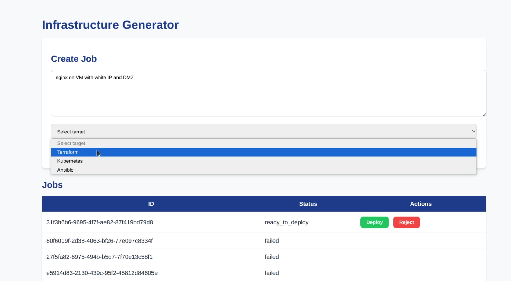
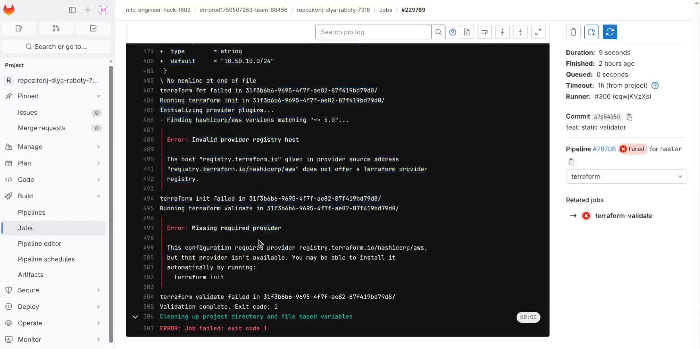
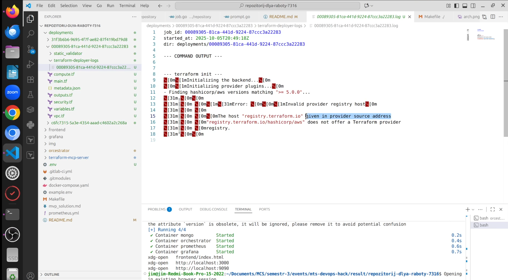
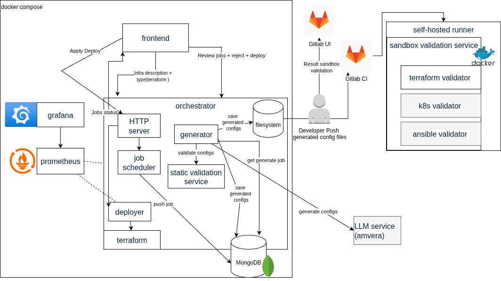

# Infrastructure Generator (Go)

**Infrastructure Generator** — сервис для автоматической генерации, валидации и деплоя инфраструктурных файлов (Terraform и др.) с использованием LLM. Проект автоматизирует создание конфигураций инфраструктуры, проверяет их синтаксис/безопасность и подготавливает к интерактивному деплою.

> Был написан за два дня в рамках `MTS-DevOps-Hack`

### 🧰 Технологии
- **Backend:** Go (1.20+)
- **Infrastructure:** Docker, Docker Compose, Terraform, Prometheus, Grafana, GitLab CI, Makefile
- **Интеграции:** Amvera (LLM API)
- **База данных:** MongoDB
- **Frontend:** HTML, CSS, JavaScript (минимальный UI)

## Пример работы
1. Вводим желаемый конфиг

2. Результат генерации

3. Результат sandbox-validation

4. Лог деплоя



---

## 🔎 Краткое описание

Сервис принимает входные задания (Jobs), генерирует инфраструктурные файлы через LLM (Amvera), прогоняет статическую и sandbox-валидацию (Terraform), хранит результаты и логирует процесс. Есть веб-интерфейс для управления задачами и мониторинга статусов деплоев в реальном времени.

Ключевые возможности:

* Генерация инфраструктурных конфигураций с помощью LLM.
* Статическая проверка конфигов (синтаксис, схема, простые правила безопасности).
* Sandbox-валидация через Terraform.
* Хранение конфигураций и логов (filesystem / MongoDB).
* CI/CD интеграция (GitLab CI) для автоматической проверки конфигов.
* Наблюдаемость: Prometheus + Grafana.

---

## Структура репозитория (основное)

```
.
├── deployments/                      # готовые деплойменты (id -> папка с tf, логами, metadata)
├── docker-compose.yaml
├── example.env                        # Пример переменных окружения
├── frontend/                          # минимальный frontend (index.html)
├── grafana/                           # provisioning Grafana (dashboards, datasources)
├── img/                               # картинки
├── Makefile
├── orcestrator/                       # основной сервис 
│   ├── app/
│   │   └── cmd/main.go                # точка входа
│   ├── config/
│   ├── usecase/
│   ├── internal/
│   │   ├── domain/                    # сущности, репозитории, usecases
│   │   └── infrastructure/            # провайдеры: llm, queue, store, validator, transport
│   └── Dockerfile
├── prometheus.yml
├── README.md                          # этот файл ^_^
```

> В папке `deployments/` каждая папка — отдельный деплой с terraform-файлами, мета-информацией, логами и результатами валидации.

---

## Компоненты системы




* **Frontend (HTML/CSS/JS)** — UI для создания Job и мониторинга.
* **Orchestrator (Go)** — центральный сервис, реализует логику генерации, валидации и деплоя.
* **Static Validator** — проверяет синтаксис и правила конфигураций (статические анализаторы).
* **Sandbox Validator** — проверяет поведение конфигов через Terraform (используется для безопасной симуляции).
* **Deployer** — компонент для интерактивного деплоя (WebSocket + HTTP).
* **LLM Connector** — интеграция с Amvera (генерация конфигов).
* **Storage** — filesystem (локально) и MongoDB (мета-данные, статус задач).
* **Monitoring** — Prometheus (метрики), Grafana (дашборды).

---

## Быстрый старт


### Требования

* Docker (рекомендуется) и docker-compose
* Go (для разработки) — 1.20+ (в проекте используется Go-модуль)
* Terraform 1.5+ (опционально — для sandbox-валидации)

### Установка

```bash
git clone <repo-url>
cd <repo-dir>
cp example.env .env      # заполните .env реальными значениями
```

### Запуск (всем стеком, локально)

```bash
# запустит сервисы, Mongo, Prometheus, Grafana
make all
```

---

## Где смотреть логи и артефакты

* Логи деплоя: `deployments/<job-id>/terraform-deployer-logs/*.log`
* Сгенерированные файлы: `deployments/<job-id>/` (`main.tf`, `variables.tf`, `network.tf`, `security.tf`, ...)
* Результаты статической проверки: `deployments/<job-id>/static_validator/analysis_results.txt`
* Мета-данные: `deployments/<job-id>/metadata.json`

---

## CI

В репозитории заложена идея интеграции с GitLab CI: пайплайн выполняет авто-проверки, запуск статической валидации для генерируемых конфигов и тесты. Добавляйте шаги `terraform fmt`, `terraform validate` в CI.

---

## Наблюдаемость и метрики

* **Prometheus** собирает метрики: HTTP запросы, ошибки, длительности, метрики LLM и статистику Jobs.
* **Grafana** содержит графики и дашборды: `grafana/dashboards/orchestrator-pretty.json`
* Метрики реализованы в `orcestrator/internal/infrastructure/metrics/metrics.go`.

Ключевые метрики:

* `orchestrator_http_requests_total`
* `orchestrator_job_status_changes`
* `orchestrator_llm_requests_total`
* `orchestrator_validator_errors_total`

